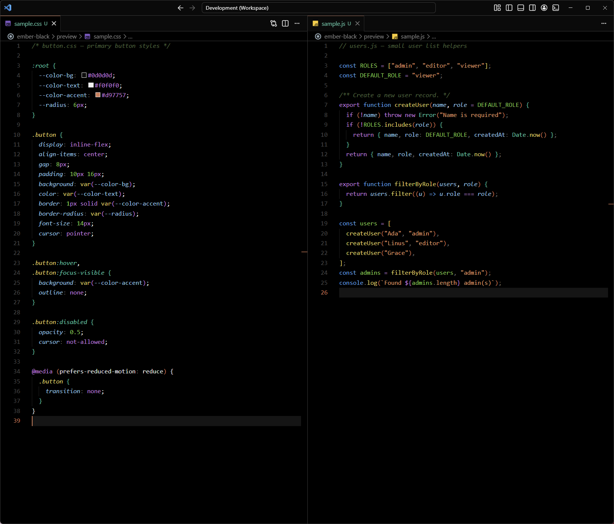

# Ember Black

An OLED-first VS Code theme built on true black with warm, Claude-inspired accents.



## Design

- **True-black editor** (`#000000`) — designed for OLED displays
- **Layered chrome** — sidebar, status bar, tabs, and title bar lift with near-black greys (`#0a0a0a`, `#0d0d0d`) for visual separation without breaking the OLED benefit
- **Warm accent** — `#d97757` orange on focus borders, buttons, cursor, text links, active tab top border, and function parentheses
- **Saturated syntax palette** — a distinct mid-tone hue per token category (purple keywords, blue tags, terracotta strings, gold functions, sky variables, green numbers, teal types) for fast visual sorting

## Install

1. Download the latest `ember-black-<version>.vsix` from [Releases](https://github.com/malinfossum/ember-black/releases)
2. In VS Code, open the Extensions view
3. Click the `⋯` menu in the top-right → **Install from VSIX...**
4. Select the downloaded file
5. Open the command palette (`Ctrl+Shift+P`) → **Preferences: Color Theme** → pick **Ember Black**

## Recommended setting

Add this to your `settings.json` so the custom parenthesis color applies:

```json
"editor.bracketPairColorization.enabled": false
```

## License

MIT
