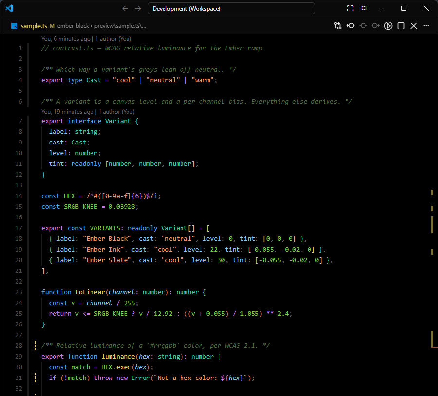
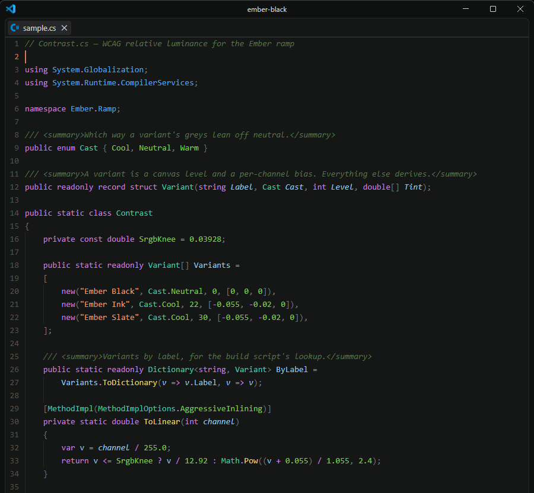
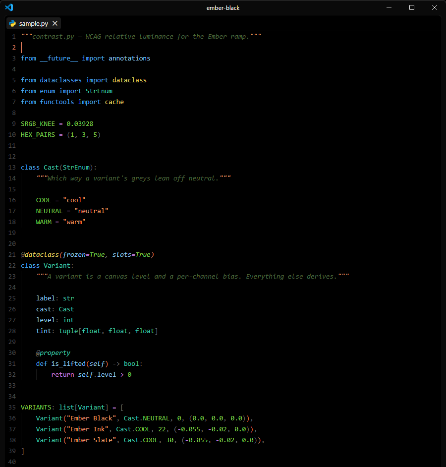

# Ember Black

An OLED-first VS Code theme built on true black with warm, Claude-inspired accents.


## Three themes

| Theme | Canvas | For |
|---|---|---|
| **Ember Black** | `#000000` | OLED panels, where true black means the pixel is off |
| **Ember Ink** | `#151616` | Long sessions, where true black is a little too stark |
| **Ember Slate** | `#1c1d1e` | LCD/IPS panels and bright rooms |

All three share one syntax palette — the saturated token colors are
byte-for-byte identical across them. Ink and Slate differ from Black in exactly
two ways: how far off black the canvas sits, and a cool blue-grey cast on the
greys. Both keep Ember Black's own contrast ratios rather than eyeballed ones,
so a lifted canvas costs no crispness.

**OLED-first, not OLED-only.** True black was designed for panels that switch
pixels off, but it holds up on LED-backlit LCDs too — the palette's contrast
ratios are the same either way. If it reads too stark on yours, Ink and Slate
are the same syntax colors on a lifted canvas.

The same C# file in each:

### Ember Black



### Ember Ink



### Ember Slate


## Design

- **True-black editor** (`#000000`) — designed for OLED displays
- **Warm accent** — `#d97757` orange on focus borders, buttons, cursor, text links, active tab top border, and function parentheses
- **Saturated syntax palette** — a distinct mid-tone hue per token category (purple keywords, blue tags, terracotta strings, gold functions, sky variables, green numbers, teal types) for fast visual sorting
- **Layered chrome** — Ember Black lifts its sidebar, status bar, tabs, and title bar above the editor with near-black greys (`#0a0a0a`, `#0d0d0d`). Ink and Slate drop the same chrome *below* the editor instead, so the eye settles on the code rather than on a frame around it

## Install

Install from the
[VS Code Marketplace](https://marketplace.visualstudio.com/items?itemName=malinfossum.ember-black),
or from inside VS Code — open Quick Open (`Ctrl+P`) and run:

```
ext install malinfossum.ember-black
```

Then open the command palette (`Ctrl+Shift+P`) → **Preferences: Color Theme** →
pick **Ember Black**, **Ember Ink**, or **Ember Slate**.

### From a VSIX

1. Download the latest `ember-black-<version>.vsix` from [Releases](https://github.com/malinfossum/ember-black/releases)
2. In VS Code, open the Extensions view
3. Click the `⋯` menu in the top-right → **Install from VSIX...**
4. Select the downloaded file

## Recommended setting

Add this to your `settings.json` so the theme's own bracket colors apply:

```json
"editor.bracketPairColorization.enabled": false
```

VS Code's built-in colorizer tints brackets by *nesting depth*. Ember Black
colors them by *kind* instead — `()` orange, `{}` teal, `[]` gold — so the shape
of a nested structure reads at a glance. Turning the built-in one off hands that
job to the theme.

Leave it on if you prefer depth colors. The theme styles those too, in
`editorBracketHighlight.foreground1`–`6`.

## Language coverage

Tuned scope-by-scope for JavaScript, TypeScript, CSS/SCSS, Python, C#, Go, Rust,
YAML, Shell, SQL, TOML, Dockerfile, Markdown, and diffs — plus the
HTML-derivative single-file components: Vue, Svelte, Astro, JSX/TSX.



Sample files for each of those live in `preview/`.

Everything else falls back rather than falling through. The theme colors the root
TextMate scopes — `punctuation`, `entity.name`, `entity.other`, `constant`,
`storage`, `support` — and lets the specific rules override them, so a language
the theme has never heard of still gets a full palette instead of plain white.
Language servers land in the same place: VS Code resolves an unmapped semantic
token through the extension's own scope map, which points back at those roots.

The exception is a server that ships no scope map for a token type. Those are
mapped by hand in `semanticTokenColors` — Pylance's brackets and modules, and
the Roslyn C# set.

## Development

Ember Black is the source of truth. Ink and Slate are generated from it:

```
npm run build
```

Edit `themes/ember-black-color-theme.json`, re-run the build, and commit all
three theme files. Never hand-edit `themes/ember-ink-color-theme.json` or
`themes/ember-slate-color-theme.json` — they are overwritten.

Each variant is two numbers in `tools/build-variants.mjs`: a canvas level and a
channel tint. Everything else is derived — every grey is re-found on the new
canvas at the same contrast ratio it held against black, and the dim tokens are
scaled in linear-light space so they keep their calibrated dimness.

`icon.png` is artwork, not a build output. Nothing in the build touches it.

## License

MIT
