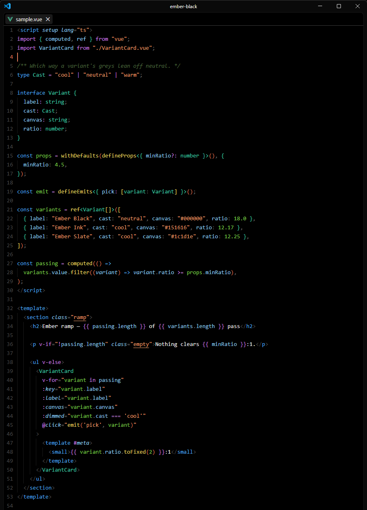

# Ember Black

An OLED-first VS Code theme built on true black with warm, Claude-inspired accents.



## Three themes

| Theme | Canvas | For |
|---|---|---|
| **Ember Black** | `#000000` | OLED panels, where true black means the pixel is off |
| **Ember Ink** | `#151616` | Long sessions, where true black is a little too stark |
| **Ember Slate** | `#1c1d1e` | LCD/IPS panels and bright rooms |

All three share one syntax palette — the saturated token colors are
byte-for-byte identical across them. Ink and Slate differ from Black in exactly
two ways: how far off black the canvas sits, and a cool blue-grey cast on the
greys. Both keep Ember Black's own contrast ratios rather than eyeballed ones,
so a lifted canvas costs no crispness.

## Design

- **True-black editor** (`#000000`) — designed for OLED displays
- **Warm accent** — `#d97757` orange on focus borders, buttons, cursor, text links, active tab top border, and function parentheses
- **Saturated syntax palette** — a distinct mid-tone hue per token category (purple keywords, blue tags, terracotta strings, gold functions, sky variables, green numbers, teal types) for fast visual sorting
- **Layered chrome** — Ember Black lifts its sidebar, status bar, tabs, and title bar above the editor with near-black greys (`#0a0a0a`, `#0d0d0d`). Ink and Slate drop the same chrome *below* the editor instead, so the eye settles on the code rather than on a frame around it

## Install

1. Download the latest `ember-black-<version>.vsix` from [Releases](https://github.com/malinfossum/ember-black/releases)
2. In VS Code, open the Extensions view
3. Click the `⋯` menu in the top-right → **Install from VSIX...**
4. Select the downloaded file
5. Open the command palette (`Ctrl+Shift+P`) → **Preferences: Color Theme** → pick **Ember Black**, **Ember Ink**, or **Ember Slate**

## Recommended setting

Add this to your `settings.json` so the custom bracket colors apply:

```json
"editor.bracketPairColorization.enabled": false
```

## Development

Ember Black is the source of truth. Ink and Slate are generated from it:

```
npm run build
```

Edit `themes/ember-black-color-theme.json`, re-run the build, and commit all
three theme files. Never hand-edit `themes/ember-ink-color-theme.json` or
`themes/ember-slate-color-theme.json` — they are overwritten.

Each variant is two numbers in `tools/build-variants.mjs`: a canvas level and a
channel tint. Everything else is derived — every grey is re-found on the new
canvas at the same contrast ratio it held against black, and the dim tokens are
scaled in linear-light space so they keep their calibrated dimness.

`icon.png` is artwork, not a build output. Nothing in the build touches it.

## License

MIT
